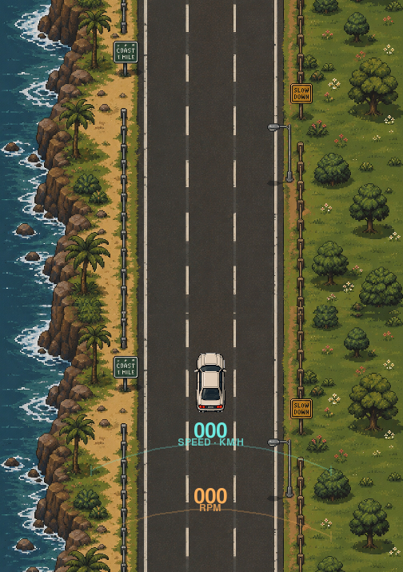
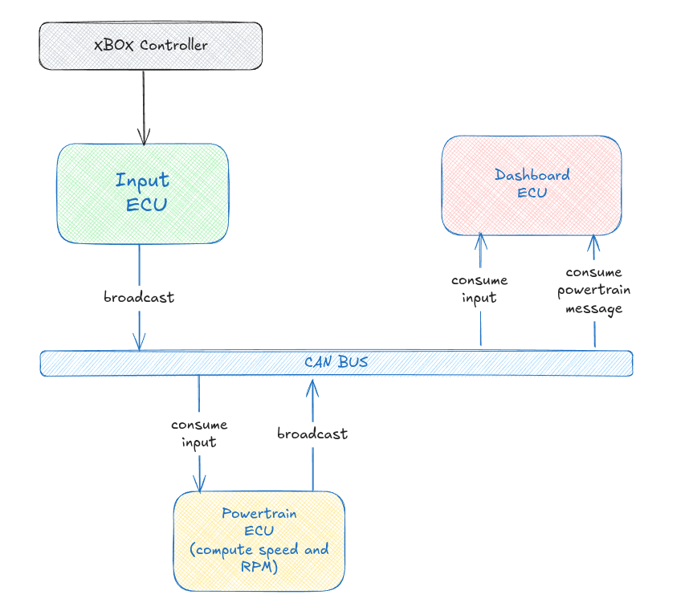
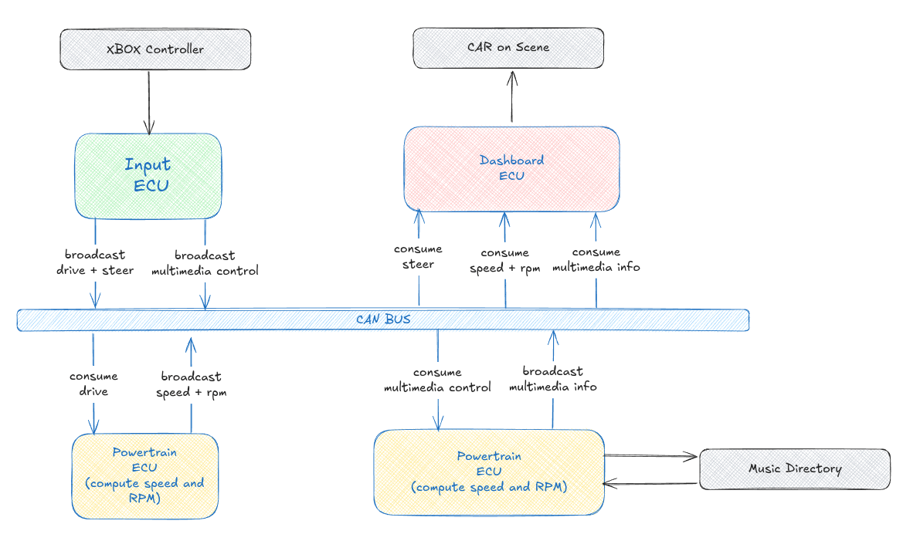

# Design

## Goal

- Use an XBOX controller as the input device to drive a simulated car.
- **Input ECU**: reads controller state, derives `throttle`, `brake`, `steering`; broadcasts on CAN bus.
- **Powertrain ECU**: subscribes to `throttle`/`brake`; computes `speed` and `rpm`; broadcasts result on CAN bus.
- **Dashboard ECU**: subscribes to input (`steering`) and powertrain (`speed`, `rpm`); renders car position/heading and speed/RPM HUD as shown above.
- End result: controller input drives the car on-screen with live speed/RPM readout, entirely via CAN bus pub/sub between ECUs.

## Architecture

## Architecture v1

- Extends the original design with multimedia: **InputECU** now also broadcasts `MediaControl` (LB/RB on the controller → previous/next track direction), alongside its existing `DriverInput` broadcast.
- **MultimediaECU**: subscribes to `MediaControl`; owns the playlist (scanned from `resources/music/`) and plays tracks; broadcasts `PlaybackStatus` (current track index) on the bus.
- **Dashboard ECU**: subscribes to `SteeringAngle` + `Speed`/`RPM` (as before) and now also `PlaybackStatus`; renders the car, speed/RPM HUD, and current track label in one window.
