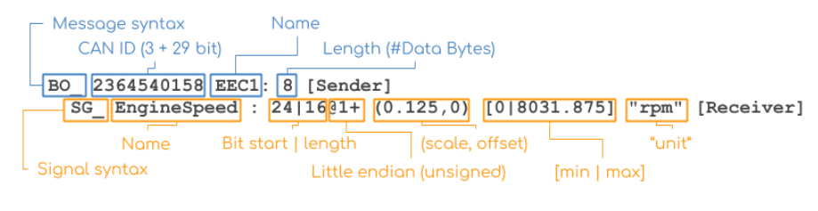

# canbusdrive

## What is DBC?

- **DBC** = CAN bus Database— a text file format for describing the contents of CAN bus messages.
- Vital for CAN bus data logging and analysis.
- Contains the information needed to decode raw CAN bus data into physical values, e.g.:

  | CAN ID     | Data bytes                |
  |------------|----------------------------|
  | `0CF00400` | `FF FF FF 68 13 FF FF FF`  |

  decodes to:

  | Message | Signal      | Value | Unit |
  |---------|-------------|-------|------|
  | EEC1    | EngineSpeed | 621   | rpm  |



For more information, see [CAN DBC File & Database Intro (CSS Electronics)](https://www.csselectronics.com/pages/can-dbc-file-database-intro).

## Setting up DBC

- Created [`dbc/car.dbc`](dbc/car.dbc) defining the CAN messages/signals from the architecture:
  - `DriverInput` (0x100, sent by `InputECU`): `Throttle`, `Brake`, `SteeringAngle`
  - `PowertrainStatus` (0x200, sent by `PowertrainECU`): `Speed`, `RPM`
- Verified the DBC parses correctly with `cantools`:
  ```
  cantools dump dbc/car.dbc
  ```
- Output:
  ```
  =================================Messages=================================

  ------------------------------------------------------------------------

  Name:           DriverInput
  Id:             0x100
  Length:         4 bytes
  Cycle time:     - ms
  Senders:        InputECU
  Layout:

                          Bit

             7   6   5   4   3   2   1   0
           +---+---+---+---+---+---+---+---+
         0 |<-----------------------------x|
           +---+---+---+---+---+---+---+---+
             +-- Throttle
           +---+---+---+---+---+---+---+---+
     B   1 |<-----------------------------x|
     y     +---+---+---+---+---+---+---+---+
     t       +-- Brake
     e     +---+---+---+---+---+---+---+---+
         2 |------------------------------x|
           +---+---+---+---+---+---+---+---+
         3 |<------------------------------|
           +---+---+---+---+---+---+---+---+
             +-- SteeringAngle

  Signal tree:

    -- {root}
       +-- Throttle
       +-- Brake
       +-- SteeringAngle

  ------------------------------------------------------------------------

  Name:           PowertrainStatus
  Id:             0x200
  Length:         4 bytes
  Cycle time:     - ms
  Senders:        PowertrainECU
  Layout:

                          Bit

             7   6   5   4   3   2   1   0
           +---+---+---+---+---+---+---+---+
         0 |------------------------------x|
           +---+---+---+---+---+---+---+---+
         1 |<------------------------------|
     B     +---+---+---+---+---+---+---+---+
     y       +-- Speed
     t     +---+---+---+---+---+---+---+---+
     e   2 |------------------------------x|
           +---+---+---+---+---+---+---+---+
         3 |<------------------------------|
           +---+---+---+---+---+---+---+---+
             +-- RPM

  Signal tree:

    -- {root}
       +-- Speed
       +-- RPM

  ------------------------------------------------------------------------
  ```
